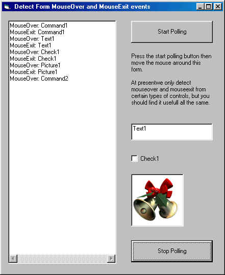

<div align="center">

## MouseOver/Exit Class


</div>

### Description

This projects demonstrates how you can detect Mouse Over and Exit events on a form using a class module.
 
### More Info
 
When used in your own projects please ensure that you exit the class before closing the form.


<span>             |<span>
---                |---
**Submitted On**   |2002-02-10 20:14:58
**By**             |[Phobos](https://github.com/Planet-Source-Code/PSCIndex/blob/master/ByAuthor/phobos.md)
**Level**          |Intermediate
**User Rating**    |4.0 (12 globes from 3 users)
**Compatibility**  |VB 6\.0
**Category**       |[Custom Controls/ Forms/  Menus](https://github.com/Planet-Source-Code/PSCIndex/blob/master/ByCategory/custom-controls-forms-menus__1-4.md)
**World**          |[Visual Basic](https://github.com/Planet-Source-Code/PSCIndex/blob/master/ByWorld/visual-basic.md)
**Archive File**   |[MouseOver\_544302102002\.zip](https://github.com/Planet-Source-Code/phobos-mouseover-exit-class__1-31658/archive/master.zip)

### API Declarations

```
Private Declare Function GetCursorPos Lib "User32" (lpPoint As POINTAPI) As Long
Private Declare Function WindowFromPoint Lib "User32" (ByVal xPoint As Long, ByVal yPoint As Long) As Long
```


